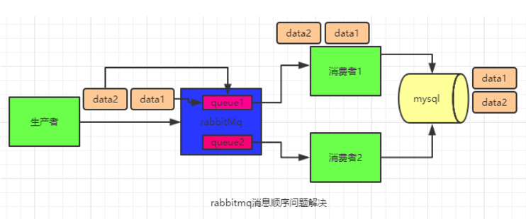

#Java语言

###8个基本类型
byte short int long 
char 
float double 
boolean

###final关键字
1，final关键字修饰基本类型，引用类型区别 
2，final修饰类、方法的用法 
3，final修饰方法的参数，参数如果为基本类型，为引用类型 
4，被final修饰的变量一旦初始化完成，就不能再次给它赋值，所以对多线程是可见的

###static关键字
1，说下类实例和对象实例 
类实例 是加载进来的那个 Class 的实例，即用来创建对象的模板,对象实例 就是由模板创建出来的一个个实际的对象 
例如类 A 由类加载器加载并初始后便有类实例 A.class，基于 A.class 创建的 a1, a2, a3, 它们的 a1.getClass(), a2.getClass(), a3.getClass() 就是 A.class 类实例 
2，引出static，static是定义类实例的成员，没有static是定义对象实例的成员 
举例，比如一个Person类有两个变量，一个static修饰的name，一个没有static修饰的age变量，那么Person.Class.getFields()方法只有name变量 
3，在多线程中，如果synchronized修饰的是static类型的方法，加锁的对象是类的class对象，和synchronized(this)是异步的 

###java中的hashcode和equal()方法
3，如果两个对象相同，那么它们的hashCode值一定要相同；如果两个对象的hashCode相同，它们并不一定相同；  
4，我们一般在覆盖equals的同时也要覆盖hashcode，让他们的逻辑一致，如果没有覆盖会出现什么情况？ 
举例，向HashSet<Person>中插入元素时，如果重写了Person的equals方法，用到了name属性，两个name属性一样的person，插入HashSet时，都能插入到HashSet，因为HashSet内部先得到元素的HashCode，找到元素的位置，两个对象的HashCode一定是不一样的，所以存放位置也不同，所以可以插入，这样两个元素比较时，返回true，但可以插入HashSet，HashSet是不允许为重复值的

###重写equal方法的原则
- 1）自反性
对于任何非null的引用值x,x.equals(x)必须返回true
- 2）对称性
对于任何非null的引用值x和y，当且仅当x.equals(y)为true时，y.equals(x)也为true。
- 3）传递性
对于任何非null的引用值x、y、z。如果x.equals(y)==true,y.equals(z)==true,那么x.equals(z)==true。
- 4）一致性
对于任何非null的引用值x和y，只要equals的比较操作在对象所用的信息没有被修改，那么多次调用x.eqals(y)就会一致性地返回true,或者一致性的返回false。
- 5）非空性
所有比较的对象都不能为空。

###创建线程的几种方法
1，实现Runable接口
2，继承Thread类
3，实现Callable接口，可以有返回值
4，线程池

###线程的状态都有哪些
1，新建状态，没调用start()方法之前，和普通对象没有区别 
2，调用start()后，进入就绪状态（runnable），系统分配cpu线程资源
3，得到cpu资源，进入运行状态(running)
4.1，阻塞状态(blocked)
4.2，等待状态(waiting)
5，死亡状态

几个小问题：
- wait与join的区别 
join()内部是利用了wait()，所以，它会释放锁，只不过它不用等待notify()/notifyAll()。它结束的条件是：1）等待时间到；2）目标线程已经run完（通过isAlive()来判断）。
- wait与sleep的区别

###怎样接受线程的返回值
1，说下使用的元素，Callable函数式接口，Future接口，FutureTask包装类，重点说下FutureTask继承的两个接口Future，Runnable 
2，说下过程，看CallableDemo类 

###线程同步的几种方式
- synchronized
    - 同步方法（1，同步static方法 2，同步普通方法，相当于同步this，当前变量）
    - 同步代码块
- Lock
    - ReentrantLock类 
        - 基于CAS的，性能好
        - 通过lock.lock和lock.unlock来获取锁和释放锁，功能可以替代synchronized
        - 可实现condition的信号通知，生产者消费者模式
        - 内部实现了公平锁与非公平锁
    - ReadWriteLock接口
        - ReentrantReadWriteLock类 
        读锁可以有很多个锁同时上锁，只要当前没有写锁；  
        写锁是排他的，上了写锁，其他线程既不能上读锁，也不能上写锁；同样，需要上写锁的前提是既没有读锁，也没有写锁；  
        两个写锁不能同时获得，下面一段程序说明下上了读锁以后，其他线程需要上写锁也无法获得 
        如果你已经有了读锁，再去试图获得写锁，将会无法获得， 一直堵住了；  
        但是如果你有了写锁，再去试图获得读锁，没问题；  
    - CountDownLatch类 
    通常的使用场景是，某个主线程接到一个任务，起了n个子线程去完成，但是主线程需要等待这n个子线程都完成任务了以后才开始执行某个操作
    - Semaphore信号量机制 
    Semaphore可以控制某个资源可被同时访问的个数，通过 acquire() 获取一个许可，如果没有就等待，而 release() 释放一个许可
###synchronized和Lock的区别
- 1，没有获取锁时，进入状态不一样，blocked waiting
- 2，被唤醒时的机制不一样，synchronized由JVM调度器来唤醒，waiting状态由另一个线程来显式唤醒notify/notifyAll
- 3，实现机制不同，synchronized由JVM实现的，Lock由AQS来实现的
- 4，使用场景也不同，synchronized互斥锁，Lock不仅实现互斥锁，还有可重入锁

###线程通信的几种方式
- synchronized、Lock
- join
- wait/notify，notifyall
- BlockingQueue
- Lock和Condition
    - CountDownLatch
    - Semaphore信号量机制
    - ReentrantReadWriteLock
    - CyclicBarrier

###说下AQS原理

###线程池有哪些类型？内部是怎样实现的
- Executors.newSingleThreadExecutor() 
核心线程数、最大线程数都为1
- Executors.newFixedThreadPool() 
核心线程数、最大线程数都为固定值
- Executors.newScheduledThreadPool() 
- Executors.newCachedThreadPool() 
核心线程数为0，最大线程数为integer.MAX_VALUE，线程等待60s无任务时会被移除 
public ThreadPoolExecutor(int corePoolSize, 
                          int maximumPoolSize, 
                          long keepAliveTime, 
                          TimeUnit unit, 
                          BlockingQueue<Runnable> workQueue, 
                          ThreadFactory threadFactory, 
                          RejectedExecutionHandler handler) //后两个参数为可选参数

###说下ThreadLocal的原理及使用场景
- 理解ThreadLocal重要的点是
    - 1，每个Thread类里都有一个容器（ThreadLocal.ThreadLocalMap），这个容器只供线程自己使用，ThreadLocal都是对当前线程的这个容器的操作
    - 2，ThreadLocal.get()，先判断当前线程是否有容器，没有先创建个设置默认值的容器，有的话就返回
    - 3，ThreadLocal.set()，是设置当前线程的容器的值，每个线程均有一个容器

ThreadLocal解决什么问题呢？
- 把变量放到ThreadLocal里面 
实际应用，说下使用AOP解决读写分离数据库时，动态改变数据源时，使用ThreadLocal解决多数据源
- 把方法放到ThreadLocal里面 
（DateUtil2_1类中有实现）比如一个线程不安全的类，SimpleDateFormat，2个线程同时访问时，可能会出现问题，解决方法有两个，一个方法是用synchronized，使方法串行访问；另一个是用ThreadLocal包装SimpleDateFormat类，这样在每一个线程的容器里都有一个SimpleDateFormat的副本，每个线程可以使用它自己容器里面的SimpleDateFormat方法，也就不会有并发问题了。

###ConcurrentHashMap加锁机制是什么，详细说一下？
   HashTable容器在竞争激烈的并发环境下表现出效率低下的原因，是因为所有访问HashTable的线程都必须竞争同一把锁，那假如容器里有多把锁，每一把锁用于锁容器其中一部分数据，
   那么当多线程访问容器里不同数据段的数据时，线程间就不会存在锁竞争，从而可以有效的提高并发访问效率，这就是ConcurrentHashMap所使用的锁分段技术，首先将数据分成一段一段的存储，
   然后给每一段数据配一把锁，当一个线程占用锁访问其中一个段数据的时候，其他段的数据也能被其他线程访问。

###volatile和synchronized区别
-    1）volatile本质是在告诉jvm当前变量在寄存器中的值是不确定的,需要从主存中读取,synchronized则是锁定当前变量,只有当前线程可以访问该变量,其他线程被阻塞住.
-    2）volatile仅能使用在变量级别,synchronized则可以使用在变量,方法.
-    3）volatile仅能实现变量的修改可见性,而synchronized则可以保证变量的修改可见性和原子性.
-    4）volatile不会造成线程的阻塞,而synchronized可能会造成线程的阻塞.

###synchronized实现原理
#####JVM1.6前
每个对象有一个监视器锁（monitor）。当monitor被占用时就会处于锁定状态，线程执行monitorenter指令时尝试获取monitor锁，过程如下：
- 1、如果monitor的进入数为0，则该线程进入monitor，然后将进入数设置为1。
- 2、如果该线程已经占有该monitor，只是重新进入，则进入monitor的进入数加1.
- 3、如果其他线程已经占用了monitor，则该线程进入阻塞状态，直到monitor的为0，才能获取monitor的所有权。
#####JVM1.7后

###同步IO和异步IO    阻塞IO和非阻塞IO  同步和异步
首先一个IO操作其实分成了两个步骤：发起IO请求和服务器内核实际的IO操作
同步IO和异步IO的区别就在于服务器处理请求的线程，在进行io操作时，是否需要等待服务器内核的I/O操作，如果服务器的accept、read、write操作是要等待内核操作完毕，那么就是同步IO，因此BIO NIO都是同步IO。
阻塞IO和非阻塞IO的区别在于第一步发起IO请求，阻塞IO是指客户端发起的I/O请求，需要等服务器彻底完成后才能返回；非阻塞是指客户端发起的I/O操作，被服务器调用后立即返回一个状态值，无需等I/O操作彻底完成，需要客户端去遍历获取IO的状态。
普通的同步和异步的区别（比如同步方法，异步方法）：所谓同步，就是在发出一个功能调用时，在没有得到结果之前，该调用就不返回。异步的概念和同步相对。当一个异步过程调用发出后，调用者不能立刻得到结果。实际处理这个调用的部件在完成后，通过状态、通知和回调来通知调用者。

###介绍下BIO

###介绍下NIO
NIO叫同步 非阻塞式IO， 同步是指发的请求被服务器的一线程处理，该线程在IO请求时，需要等待内核的IO，所以是同步的；非阻塞是指，多个客户端发起的请求，可能有连接请求，IO请求等不同的请求，服务器用一个线程统一去处理，是连接请求就创建一个channel注册到selector中，如果是io请求就调用相应的IO方法，客户端发起请求后，不需要等待服务器返回，可以做其它操作，自己去循环获取服务器处理结果，所以是非阻塞的。
优点是一台服务器能同时处理多个请求，且不阻塞客户端
适合连接请求多，每个请求短的情况

###BIO与NIO区别

###java对象从创建到销毁的流程
当对象在堆创建时，将进入年轻代的Eden Space。垃圾回收器进行垃圾回收时，扫描Eden Space和A Suvivor Space，如果对象仍然存活，则复制到B Suvivor Space，
如果B Suvivor Space已经满，则复制到Old Gen。同时，在扫描Suvivor Space时，如果对象已经经过了几次的扫描仍然存活，JVM认为其为一个持久化对象，则将其移到Old Gen。
扫描完毕后，JVM将Eden Space和A Suvivor Space清空，然后交换A和B的角色（即下次垃圾回收时会扫描Eden Space和B Suvivor Space。这么做主要是为了减少内存碎片的产生。

###简单介绍下JDK8的新特性？
- Lambda表达式
	使用lambda来实现函数式接口
- Optional
	解决空指针问题，链式编程
- Stream API
	Stream API是把真正的函数式编程风格引入到Java中。其实简单来说可以把Stream理解为MapReduce
- 方法引用
- JVM内存结构上取消了永久代，添加了元空间metaspace

#Spring

###Spring用到了java哪些知识
- 加载spring配置文件时，使用了ResourceLoader，ResourceLoader使用了文件流，文件流
- 读取完配置文件，通过反射得到BeanDefinition，反射
- Bean为单例，用到了单例模式
- AOP用到了java的动态代理，cglib使用了asm
- 。。。。

###Spring aop的应用场景
- 验证权限，异常日志处理
- 缓存
- 注解型的事务
- 多数据源切换

###Spring事务默认配置下，没有使用事务的方法，调用使用了事务的方法，事务会生效吗？
不会 
1，Spring事务帮我们做了什么 2，反射，方法是否有@Transaction注解 3，有注解时，没有注解时

###Bean的生命周期的整个过程

###IOC有哪些常用的注解
(@Configuration)注解表明此类为配置类，包含了Spring应用上下文中如何创建bean的细节； 
(@Bean)注解表明该方法会返回一个对象，并需要将其注册为Spring应用上下文中的bean，并且可以在方法中完成依赖注入； 
(@Component)注解表明该类会作为组件类，并告知Spring要为此类创建bean； 
(@ComponentScan(packName))注解表明在指定包下扫描带有Component注解的类，并为其创建bean； 
(@AutoWired)注解申明了依赖，自动装配，可以用于属性和set方法； 
(@Import(xxx.class))注解将括号中声明的JAVA配置类导入当前配置类； 
(@ImportResource(classpath:xxx.xml))注解将括号中声明的XML配置导入当前配置类； 
(@Profile())注解表明只有此Profile激活时(配置spring.profile.active和spring.profile.default)，此Bean才会被创建，没有Profile注解的总是会被创建； 
(@Conditional(? implents Condition))注解表明只有给定条件计算结果为true时才会创建bean，可以用于带@Bean注解的方法上，括号内为实现了Condition接口的类； 
(@Primary)当匹配的Bean不止一个时，此注解可以设置首选，避免自动装配时的歧义性； 
(@Qualifier)注解使用限定符，在可选Bean上缩小范围最终达到只有1个Bean满足所规定的限制条件； 
(@Scope)注解声明了bean的作用域；proxyMode属性设置作用域代理，代理对bean进行懒解释并将调用委托给会话/请求作用域内真正的bean； 
(@Aspect)注解表明该类是一个切面； 
　　　-(@Pointcut)注解表明在一个@Aspect切面内定义可重用的切点 
　　　-(@After)注解表明通知方法会在目标方法返回或抛出异常后调用； 
　　　-(@AfterReturning)注解表明通知方法会在目标方法返回后调用； 
　　　-(@AfterThrowing)注解表明通知方法会在目标方法抛出异常后调用； 
　　　-(@Around)注解表明通知方法会将目标方法封装起来；该通知方法需要接受ProceedingJoinPoint作为参数，通过它来调用被通知的方法，当要将控制权交给被通知方法时，需要调用它的proceed方法； 
　　　-(@Before)注解表明通知方法会在目标方法调用之前执行； 
(@EnableWebMvc)启用Spring MVC； 
(@Controller)声明一个控制器，基于@Componet注解，辅助实现组件扫描； 
　　　-(@RequetsMapping)注解声明了它们所要处理的请求，可以在类和方法上声明； 
　　　　　　　(@RequestParam)   
　　　　　　　(@PathVariable) 

说下BeanFactoryPostProcesser、BeanPostProcesser  

#Spring Boot

#Spring MVC
#MySql
###数据库优化
- 表的建立要满足三范式
- 字段的选择
    - 数字类型时
    - 字符类型时
    - 时间类型时
- 字符编码会影响数据库占用空间
    UTF-8：一个汉字 = 3个字节，英文是一个字节 
    GBK： 一个汉字 = 2个字节，英文是一个字节
- sql优化
    - 只返回需要的数据（字段，where）
    - join代替子查询
    - 建立索引
- 索引的使用
    - 什么样的sql不走索引 
    - 什么样的字段需要建立索引
    - 组合索引 是否使用索引使用explair关键字查看
- 存储过程的使用
    表到表的数据移动
- 锁的使用
    - 乐观锁
    - 悲观锁     
系统层面
- 使用Redis缓存，减少数据库访问
- 读写分离，将数据分开读写，提升性能
- 分库分表

###MyISAM、InnoDB区别 4个
-  MyISAM类型不支持事务，而InnoDB类型支持。
-  MyISAM表不支持外键，InnoDB支持
-  MyISAM锁的粒度是表级，而InnoDB支持行级锁定。
-  MyISAM支持全文类型索引，而InnoDB不支持全文索引。(mysql 5.6后innodb支持全文索引)
当你的数据库有大量的写入、更新操作比查询比较少，数据完整性要求比较高的时候就选择innodb表。
当你的数据库主要以查询为主，更新和写入比较少，并且业务方面数据完整性要求不那么严格，就选择mysiam表。

###数据库事务的4个特性
- 原子性
- 一致性
- 隔离性
- 持久性

###数据库隔离级别 4种
1）Serializable (串行化)：可避免脏读、不可重复读、幻读的发生。
2）Repeatable read (可重复读)：可避免脏读、不可重复读的发生。
3）Read committed (读已提交)：可避免脏读的发生。
4）Read uncommitted (读未提交)：最低级别，任何情况都无法保证。

###数据库如何实现rollback的？
数据在写入数据库之前，先对改动数据的写入 redo log 和 undo log(回滚日志)，然后再提交事务 
如果成功提交事务就会把操作写入磁盘； 
如果失败就会根据undo log逆向还原到事务操作之前的状态。 

#Redis

###redis支持哪些数据结构。
支持5种数据类型</b>
String</b>
Hash </b>
</b>
hset key field fieldvalue</b>
hget key field</b>
hgetall key</b>

List</b>
有序的，可重复的消息队列，缓冲队列</b>
Set</b>
无序的，不可重复的，可以求两个set的交集，并集，差集</b>
Sets 集合的概念就是一堆不重复值的组合。利用Redis提供的Set数据结构，可以存储一些集合性的数据，比如在微博应用中，可以将一个用户所有的关注人存在一个集合中，将其所有粉丝存在一个集合。Redis还为集合提供了求交集、并集、差集等操作，可以非常方便的实现如共同关注、共同喜好、二度好友等功能，对上面的所有集合操作，你还可以使用不同的命令选择将结果返回给客户端还是存集到一个新的集合中。</b>
Sorted set </b>
有序的set，插入的数据自动有序</b>
Redis sorted set的使用场景与set类似，区别是set不是自动有序的，而sorted set可以通过用户额外提供一个优先级(score)的参数来为成员排序，并且是插入有序的，即自动排序。当你需要一个有序的并且不重复的集合列表，那么可以选择sorted set数据结构，比如twitter 的public timeline可以以发表时间作为score来存储，这样获取时就是自动按时间排好序的。</b>
另外还可以用Sorted Sets来做带权重的队列，比如普通消息的score为1，重要消息的score为2，然后工作线程可以选择按score的倒序来获取工作任务。让重要的任务优先执行。</b>

###redis为什么是单线程的
因为CPU不是Redis的瓶颈。Redis的瓶颈最有可能是机器内存或者网络带宽。既然单线程容易实现，而且CPU不会成为瓶颈，那就顺理成章地采用单线程的方案了。 
redis的性能，普通服务器可以处理几万到十几万的请求，如果有几十万的并发，可以考虑cluster集群模式。 
万一CPU成为Redis瓶颈了，或者，你就是不想让服务器其他核闲置，那怎么办？</b>
那也很简单，你多起几个Redis进程就好了。Redis是keyvalue数据库，又不是关系数据库，数据之间没有约束。
只要客户端分清哪些key放在哪个Redis进程上就可以了。redis-cluster可以帮你做的更好。 

###Redis单线程模型是什么 
Redis客户端对服务端的每次调用都经历了发送命令，执行命令，返回结果三个过程。
其中执行命令阶段，由于Redis是单线程来处理命令的，所有每一条到达服务端的命令不会立刻执行，所有的命令都会进入一个队列中，然后逐个被执行。
并且多个客户端发送的命令的执行顺序是不确定的。但是可以确定的是不会有两条命令被同时执行，不会产生并发问题，这就是Redis的单线程基本模型。

###Redis为什么这么快
- 1）绝大部分请求是纯粹的内存操作（非常快速）
- 2）采用单线程,避免了不必要的上下文切换和竞争条件
- 3）采用IO多路复用模型
这里“多路”指的是多个网络连接，“复用”指的是复用同一个线程。 
Redis采用非阻塞的I/O多路复用技术，可以使用单个Redis线程高效的处理多个客户端连接请求（尽量减少网络 IO 的时间消耗），且 Redis 在内存中操作数据，速度非常快 

###一个key值如何在redis集群中找到存储在哪里。 
一个Redis集群总共有16384个slot槽，比如有三个节点，意味着这三个接点要占满这些slot，看图：
</b>

###redis持久化策略
- RDB （RedisDataBase）
- AOF (append only log)
采用RDB机制时，快照方式，每隔一段时间，Redis会fork一个进程，把整个db 在这一时间点的快照dump下来，存储到硬盘中。
恢复时，只会恢复这一时间点的数据，时间点后的数据不会恢复，粒度大
采用AOF机制时，每次写操作指令，都会把写指令写到一个日志文件里，利用日志恢复数据，粒度较小，准确性高，只有crash之前没有来得及做日志的操作没办法恢复。
#####选择的标准
如果系统愿意牺牲一些性能，换取更高的缓存一致性，使用AOF；
如果系统性能要求特别高，写操作非常频繁，Redis数据一致性要求又不太高，使用RDB

###redis的部署方式，主从，集群

###redis的哨兵模式

#MyBatis

###Mybaits中#和$区别
- 1）${}是Properties文件中的变量占位符，有可能会引起sql注入
- 2）#{}是sql的“参数占位符”，Mybatis会将sql中的#{}替换为?号，在sql执行前会使用PreparedStatement的参数设置方法，按序给sql的?号占位符设置参数值，
比如ps.setInt(0, parameterValue)，#{item.name}的取值方式为使用反射从参数对象中获取item对象的name属性值，相当于param.getItem().getName()。

#队列

#JVM
###JVM内存模型
JMM Java内存模型是一种规范，解决多线程通过共享内存进行通信时，各个线程的本地内存数据不一致、编译器会对代码指令重排序、处理器会对代码乱序执行等带来的问题 
作用：JMM就作用于工作内存和主存之间数据同步过程。它规定了如何做数据同步以及什么时候做数据同步，
目的是保证并发编程场景中的原子性、可见性和有序性。 
Java语言对内存模型的实现 
在 Java 中提供了一系列和并发处理相关的关键字，比如 Volatile、Synchronized、Final、Concurren 包等。 
用volatile修饰之后：
- 	第一：使用volatile关键字会强制将修改的值立即写入主存；
- 	第二：使用volatile关键字的话，当线程2进行修改时，会导致线程1的工作内存中缓存变量stop的缓存行无效（反映到硬件层的话，就是CPU的L1或者L2缓存中对应的缓存行无效）；
-   第三：由于线程1的工作内存中缓存变量stop的缓存行无效，所以线程1再次读取变量stop的值时会去主存读取。
- volatile关键字能禁止指令重排序，所以volatile能在一定程度上保证有序性。

###JVM的内存结构
- 程序计数器：线程私有。
是一块较小的内存，是当前线程所执行的字节码的行号指示器。是Java虚拟机规范中唯一没有规定OOM（OutOfMemoryError）的区域。
- Java栈：线程私有。
生命周期和线程相同。 
执行每个方法都会创建一个栈帧，用于存储存放局部变量表，操作数栈，动态链接，方法出口。 
局部变量所需要的内存空间大小在编译期间完成分配。所以栈帧的大小不会改变。 
存在两种异常情况：若线程请求深度大于栈的深度，抛StackOverflowError。若栈在动态扩展时无法请求足够内存，抛OOM。 
- Java堆：所有线程共享。虚拟机启动时创建。存放对象实例和数组。所占内存最大。分为新生代（Young区），老年代（Old区）。新生代分Eden区，Servior区。Servior区又分为From space区和To Space区。Eden区和Servior区的内存比为8:1。 当扩展内存大于可用内存，抛OOM。
- 方法区：所有线程共享。用于存储已被虚拟机加载的类信息、常量、静态变量等数据。又称为非堆（Non – Heap）。方法区又称“永久代”。GC很少在这个区域进行，但不代表不会回收。
这个区域回收目标主要是针对常量池的回收和对类型的卸载。当内存申请大于实际可用内存，抛OOM。
- 本地方法栈：线程私有。与Java栈类似，但是不是为Java方法（字节码）服务，而是为本地非Java方法服务。也会抛StackOverflowError和OOM。

###可以被作为GC Roots的对象
-   1.栈中引用的对象
        - A a = new A();//满足栈中的引用的对象
-   2.方法区中“类变量”引用的对象
	    - static int a=1 静态属性在方法区
-   3.方法区中“常量”引用的对象
	    - final int a=1;常量 在方法区
	    - final String a="abc";常量 在方法区
        - final Object obj=new Object()；对象分配在堆上，变量obj分配在方法区，final修饰的obj，表示obj所指的引用不可变
-   4.本地方法栈中Native方法（JNI: Java Native Interface）引用的对象

###年轻代 标记复制算法会不会STW？为什么

###JVM的参数
- -Xms
- -Xmx
- -Xmn
- -Xss
- -XX:NewRatio
- -XX:SurvivoRatio
- -XX:PermSize
- -XX:MaxPermSize
- -XX:MatespaceSize
- -XX:MaxMatespaceSize
</b>

###线上工具命令
- jps
- jstack pid >> java.txt
- jstat 
- jinfo
- jmap 或者 -XX:HeapDumpOnOutOfMemoryError

###Minor GC ，Full GC 触发条件
- Minor GC触发条件：当Eden区满时，触发Minor GC。
- Full GC触发条件：
    - （1）调用System.gc时，系统建议执行Full GC，但是不必然执行
    - （2）老年代空间不足
    - （3）方法区空间不足
    - （4）通过Minor GC后进入老年代的大小大于老年代的可用内存
    - （5）由Eden区、From Space区向To Space区复制时，对象大小大于To Space可用内存，则把该对象转存到老年代，且老年代的可用内存小于该对象大小
    - JVM1.8以后，Metaspace由于会不断扩容，到-XX:MetaspaceSize参数指定的量时，就会发生FGC

###说下CMS收集器
CMS(Concurrent Mark Sweep 并发 标记 清理) 
目的：重视服务的响应速度，希望系统停顿时间最短 
过程：
- 1，初始标记，需要stop the world，标记GCRoot可达的对象，速度很快
- 2，并发标记，并发的意思是，不需要stop the world，和用户线程并发执行，标记所有对象，用时最长
- 3，重新标记，需要stop the world，多gc线程并发标记，修复那些并发标记阶段，因用户线程导致的，标记发生变动的那一部分对象
- 4，并发清除，并发清理没有标记的对象
优点：响应速度快，系统停顿时间短 
缺点：消耗cpu，会产生内存碎片 
为什么停顿时间短：需要STW只有1，3两个阶段，一个是标记GC Root，一个是重新标记，两阶段速度都比较快 

###说下G1收集器
适合：多核CPU，大内存
特点：高吞吐量，gc时间短
#####内存结构
- 以往的垃圾回收算法，使用的堆内存结构，内存空间需要是连续的，在G1算法中，堆内存被划分为多个大小相等的内存块（Region），每个Region是逻辑连续的一段内存，
  说明每个Region在运行时都充当了一种角色，Eden，Servivor，Old，Humongous
#####三种回收模式
- young gc
发生在年轻代的GC算法，一般对象（除了巨型对象）都是在eden region中分配内存，当所有eden region被耗尽无法申请内存时，就会触发一次young gc，
这种触发机制和之前的young gc差不多，执行完一次young gc，活跃对象会被拷贝到survivor region或者晋升到old region中。
- mixed gc
当越来越多的对象晋升到老年代old region时，为了避免堆内存被耗尽，虚拟机会触发一个混合的垃圾收集器，即mixed gc，
该算法并不是一个old gc，除了回收整个young region，还会回收一部分的old region，这里需要注意：是一部分老年代，而不是全部老年代，
可以选择哪些old region进行收集，从而可以对垃圾回收的耗时时间进行控制。
那么mixed gc什么时候被触发？
mixed gc中也有一个阈值参数 -XX:InitiatingHeapOccupancyPercent，当老年代大小占整个堆大小百分比达到该阈值时，会触发一次mixed gc.
mixed gc的执行过程有点类似cms，主要分为以下几个步骤：
initial mark: 初始标记过程，整个过程STW，标记了从GC Root可达的对象
concurrent marking: 并发标记过程，整个过程gc collector线程与应用线程可以并行执行，标记出GC Root可达对象衍生出去的存活对象，并收集各个Region的存活对象信息
remark: 最终标记过程，整个过程STW，标记出那些在并发标记过程中遗漏的，或者内部引用发生变化的对象
clean up: 垃圾清除过程，如果发现一个Region中没有存活对象，则把该Region加入到空闲列表中
- full gc
如果对象内存分配速度过快，mixed gc来不及回收，导致老年代被填满，就会触发一次full gc，
G1的full gc算法就是单线程执行的serial old gc，会导致异常长时间的暂停时间，需要进行不断的调优，尽可能的避免full gc

###垃圾收集器的选择
- 1，服务器，大内存，多核cpu，优先选择G1
- 2，单线程或client端选serial+serial Old
- 3，服务端如果CPU资源比较敏感或者注重吞吐量，使用Parallel Scavenage+Parallel Old
- 4，服务器如果注重回收停顿的时间，使用ParaNew+CMS

#设计模式
###建造者模式

#分布式系统常见问题
###分布式事务怎样处理的？
- 两阶段提交
- 拆分为两个本地事务进行
- 使用RocketMQ
- TCC

###后台怎样防止两次重复的请求？
- 如果是update数据库可以不用管，如果是set Redis也可以不用管，查询也不用管
- 利用数据库唯一性索引
	1. 服务器A接收到请求之后,对请求信息hash运算,得到hash值hashCodeA; 
	2. 保存hashCodeA 到数据库,相应的列(column)做unique约束; 
	3. 保存成功之后,才进行正常业务逻辑处理,比如提交订单; 
	4. 服务器B接收到相同的请求后,也得到相同的hash值,hashCodeA, 
	5. 服务器B 保存hashCodeA 到数据库,肯定失败,因为相同的hash值已经存在; 
	6. 因为保存失败,所以后面的业务逻辑不会执行. 
缺点：如果hash保存到库，还没有开始处理请求，这时数据库挂了，重启以后hash已经保存到库，这时再重发请求，这笔请求就不会处理 
- 结合前端处理
请求页面，服务器后端生成token并保存到redis，并把token返回到前端 
用户post请求时带上token，后端收到请求，先去redis中查找，如果存在这个token，先处理请求，然后删掉这个token 
这样后面重发的请求，去redis查找，发现不存在，就不去处理 
缺点：需要前端配合，不灵活 

###想想为什么要使用MQ
- 1.解耦，系统A在代码中直接调用系统B和系统C的代码，如果将来D系统接入，系统A还需要修改代码，过于麻烦！
- 2.异步，将消息写入消息队列，非必要的业务逻辑以异步的方式运行，加快响应速度
- 3.削峰，并发量大的时候，所有的请求直接怼到数据库，造成数据库连接异常

###MQ如果丢包的话怎么办？
- 生产者丢包
- 队列丢包
- 消费者丢包
    ①自动确认模式 
    消费者挂掉或异常了，队列收不到ack时，会重回到队列，消息会不断的被重发，直到处理成功，所以不会丢失消息。 
    ②手动确认模式 
    如果消费者来不及处理就死掉时，没有响应ack时，队列会重复发送一条信息给其他消费者； 
    如果监听程序处理异常了，且未对异常进行捕获，会一直重复接收消息，然后一直抛异常； 
    如果对异常进行了捕获，但是没有在finally里ack，也会一直重复发送消息(重试机制)。 
    ③不确认模式 
    acknowledge="none" 不使用确认机制，只要消息发送完成会立即在队列移除，无论客户端异常还是断开，只要发送完就移除，不会重发。 

###MQ如何保证消息的顺序性？
要实现严格的顺序消息，简单且可行的办法就是：保证 生产者 - queue - 消费者是一对一对一的关系 
这样的设计虽然简单易行，但也会存在一些很严重的问题，比如： 
- 1、并行度就会成为消息系统的瓶颈（吞吐量不够）
- 2、更多的异常处理，比如：只要消费端出现问题，就会导致整个处理流程阻塞，我们不得不花费更多的精力来解决阻塞的问题。但我们的最终目标是要集群的高容错性和高吞吐量
RabbitMQ 

把有序的消息按同一规则（对唯一标识进行 hash），有顺序的放入一个 queue 里面，一个queue只对应一个消费者，消费者只取一个 queue的数据，这样执行的顺序是有序的。 

###幂等概念有没有了解过
幂等性是数学上的含义是对于参数 x，f(x)=f(f(x));比如绝对值函数。  
在分布式环境下表示的是对于同样的请求，在一次或者多次请求的情况下对系统的使用资源是一样的，保证失败重试不会导致提交两次。 方法：带版本号的方式； 采用数据库唯一索引方式； 

#大赛系统

#开放式问题

###cpu很高 怎样排查
- 1，jps -l 得到pid
- 2，jstack pid >> file.txt 导出CPU占用高进程的线程栈
- 3，top -H -p PID 查看对应进程的哪个线程占用CPU过高
- 4，echo "obase=16; PID" | bc  将线程的PID转换为16进制,大写转换为小写
- 5，在第二步导出的Java.txt中查找转换成为16进制的线程PID。找到对应的线程栈信息，找到对应的代码行

###工作这么久你遇到的最难的技术点是什么？
我这边根据具体的工具经理，回答的是 kafka 的初次使用，因为当时是公司内部第一个引入 kafka，之前没有小组使用过，所以要采很多坑。并且那个时候 kafka 还没有发布1.0版本，官网和网上提供的版本很杂乱不兼容。

###你自己认为自己最熟悉的技术是什么？
   java语言 多线程计算 
   Spring Boot
   消息队列的使用
   Redis

